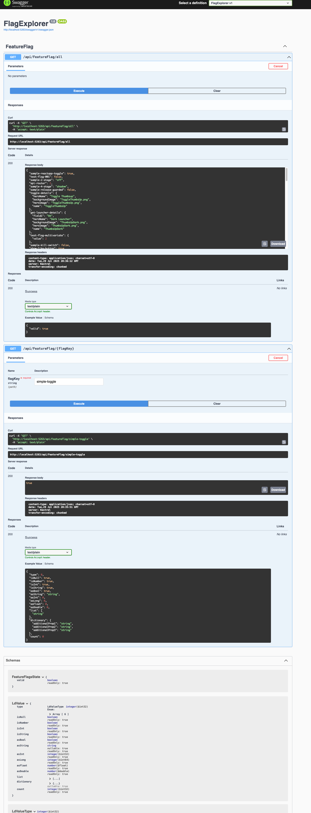

# Starting
```
> dotnet run
Building...
info: Microsoft.Hosting.Lifetime[14]
      Now listening on: http://localhost:5263
info: Microsoft.Hosting.Lifetime[0]
      Application started. Press Ctrl+C to shut down.
info: Microsoft.Hosting.Lifetime[0]
      Hosting environment: Development
info: Microsoft.Hosting.Lifetime[0]
      Content root path: /Users/btan/work/demos/sample-.NET/FlagExplorer.clean
warn: Microsoft.AspNetCore.HttpsPolicy.HttpsRedirectionMiddleware[3]
      Failed to determine the https port for redirect.

```

```
> open http://localhost:5263/swagger/index.html
```

